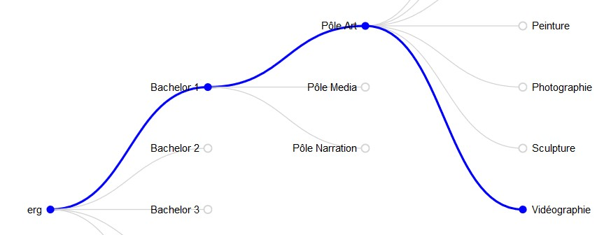

# ERG Dendrogram
> Plan d'étude interactif pour les étudiants de l'ERG

Entre les pôles, les options principales, le stage interne, les cours théoriques obligatoires ou facultatifs, 
les étudiants ont souvent du mal à élaborer leur plan d'étude (choix des cours et options au sein de l'école). 

Ce module interactif a pour but de **faciliter les étudiants dans le choix de leurs options**, et de rendre visible 
les parcours possibles à l'ERG et **la transversalité des disciplines** au sein de l'école.

## Pour commencer
Téléchargez le dossier du projet sur votre ordinateur, et ouvrez `index.html`. 

### Librairies
Ce parcours a été développé avec la librairie [D3](https://github.com/d3/d3).
[Lity](http://sorgalla.com/lity/) est utilisé pour générer des *lightboxs*.

### Prérequis
Pas de prérequis.

## Configuration
🌀 Pour visualiser le schéma sous sa forme circulaire, importez `radial.js` et commentez la ligne `` dans `index.html`.

## À faire
- [ ] Terminer la structure `json` des orientations/options/pôles
- [ ] Ajouter un état **open** / **close** aux branches
- [ ] Styliser les *branches* de manière plus sémantique (---- = optionnelle / —— = obligatoire / ━━━ = choisie)
- [ ] Ajouter dynamiquement les informations relatives à chaque option au sein d'une fenêtre complémentaire
- [ ] Rendre le module *responsive*

## License
MIT
